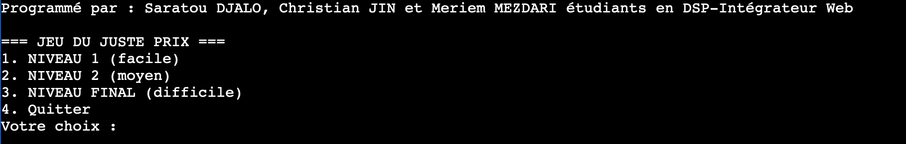
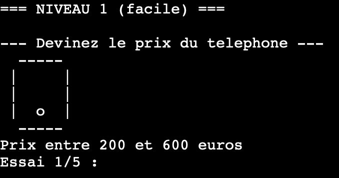

# 🎯 Jeu du Juste Prix en C

Projet réalisé en collaboration avec :

* Christian JIN
* Saratou DJALO

---

# Principe du jeu

Le principe du jeu est simple :
le programme génère un prix aléatoire, et le joueur doit deviner le bon prix en un nombre limité d’essais.

À chaque tentative, le jeu indique si le prix proposé est **trop bas**, **trop haut** ou **correct**.

Le jeu se déroule entièrement dans **le terminal**, avec des **dessins en ASCII** pour représenter les objets, ce qui rend le jeu plus visuel et plus ludique.

---

# Les différents niveaux

Le jeu est composé de **trois niveaux de difficulté**.

## Niveau 1 – Facile

* Objets : **téléphone, tablette et télévision**
* Prix en **nombres entiers**
* **5 essais par objet**
* Le joueur doit réussir **les trois objets** pour passer au niveau suivant

---

## Niveau 2 – Moyen

* Objets : **stylo, lunettes et trousse**
* Prix en **nombres décimaux**
* Une **marge de tolérance** est acceptée pour les réponses
* La difficulté augmente car il faut être **plus précis**

---

## Niveau 3 – Difficile (Niveau final)

* Le gros lot : **une voiture**
* Prix compris entre **150 000 et 200 000 euros**
* **Seulement 5 essais**
* Si le joueur gagne, il remporte **le gros lot**

---

# Fonctionnement technique

* Les prix sont générés de manière aléatoire grâce aux fonctions **rand()** et **srand()**

* Le programme utilise :

  * des **fonctions** pour organiser le code
  * des **conditions (if / else)**
  * des **boucles (while)**

* Le menu permet au joueur de **choisir son niveau ou de quitter le jeu**

---

# 1. Les bibliothèques utilisées

```c
#include <time.h>
#include <stdlib.h>
#include <stdio.h>
```

* **stdio.h** : permet d’utiliser `printf` et `scanf` pour l’affichage et la saisie utilisateur
* **stdlib.h** : contient `rand()` et `srand()` pour la génération de nombres aléatoires
* **time.h** : permet d’initialiser l’aléatoire avec `time(NULL)`

Sans `srand(time(NULL))`, les prix seraient toujours les mêmes à chaque lancement du jeu.

---

# 2. Génération des prix aléatoires

### Prix entier (niveau 1 et 3)

```c
int generationPrix(int min, int max){
    return rand() % (max - min + 1) + min;
}
```

* Génère un **nombre entier aléatoire entre min et max**

### Prix décimal (niveau 2)

```c
float generationPrixFloat(float min, float max){
    return min + ((float)rand() / RAND_MAX) * (max - min);
}
```

* Génère un **prix flottant**
* Rend le jeu plus difficile car le joueur doit être précis

---

# 3. Dessins ASCII des objets

Exemple :

```c
void dessinerTelephone(){
    printf("  -----\n");
    printf(" |     |\n");
    printf(" |     |\n");
    printf(" |  o  |\n");
    printf("  -----\n");
}
```

* Chaque fonction affiche un **dessin en caractères**
* Rend le jeu **plus interactif et visuel**
* Chaque objet possède **son propre dessin**

---

# 4. Récupération des choix du joueur

### Choix entier

```c
int choixUtilisateur(){
    int choix;
    scanf("%d", &choix);
    return choix;
}
```

### Choix décimal

```c
float choixUtilisateurFloat(){
    float valeur;
    scanf("%f", &valeur);
    return valeur;
}
```

---

# 5. Niveau 1 – Deviner un prix entier

```c
int devinerPrix(char* objet, int min, int max)
```

Fonctionnement :

1. Génère un **prix secret**
2. Affiche le **nom et le dessin de l’objet**
3. Le joueur a **5 essais**
4. À chaque essai :

   * indique **trop bas / trop haut**
   * ou **gagné**
5. Retourne :

   * **1 si gagné**
   * **0 si perdu**

Exemple :

```c
if (proposition < prixSecret)
    printf("Trop bas !\n");
```

---

# 6. Niveau 2 – Prix décimaux

```c
int devinerPrixNiveau2(char* objet, float min, float max)
```

Particularités :

* Prix en **float**
* Tolérance de **±0.1**

```c
if (proposition < prixSecret - 0.1)
```

Cela évite d’être **trop strict avec les nombres décimaux**.

---

# 7. Niveau 3 – Le gros lot

```c
int devinerPrixNiveau3()
```

* Un seul objet : **la voiture**
* Prix **très élevé**
* Même logique que le **niveau 1**

---

# 8. Enchaînement des niveaux

Exemple niveau 1 :

```c
if (devinerPrix("telephone", 200, 600))
{
    if (devinerPrix("tablette", 300, 800))
    {
        if (devinerPrix("television", 400, 1200))
```

Le joueur doit **réussir chaque objet pour avancer**.

En cas d’échec, il peut **recommencer ou quitter**.

---

# 9. Le menu principal

```c
void menu()
```

* Affiche **les niveaux**
* Récupère **le choix du joueur**
* Lance **le bon niveau avec if / else**

---

# 10. Fonction main()

```c
int main(){
    srand(time(NULL));
    menu();
    return 0;
}
```

* Initialise **l’aléatoire**
* Lance **le menu**
* Point d’entrée du programme


# ▶️ Comment jouer au jeu

Le jeu peut être exécuté directement dans un **compilateur C en ligne**.

### Étapes pour jouer :

1. Copier le code du fichier `Juste_Prix.c`
2. Aller sur un compilateur C en ligne (par exemple OnlineGDB : https://www.onlinegdb.com)
3. Coller le code dans l’éditeur
4. Cliquer sur **Run / Exécuter**
5. Jouer directement dans le **terminal du compilateur**

Le jeu se joue entièrement dans le **terminal interactif**.

# 🖼 Aperçu du jeu

## Menu du jeu



## Exemple de partie



